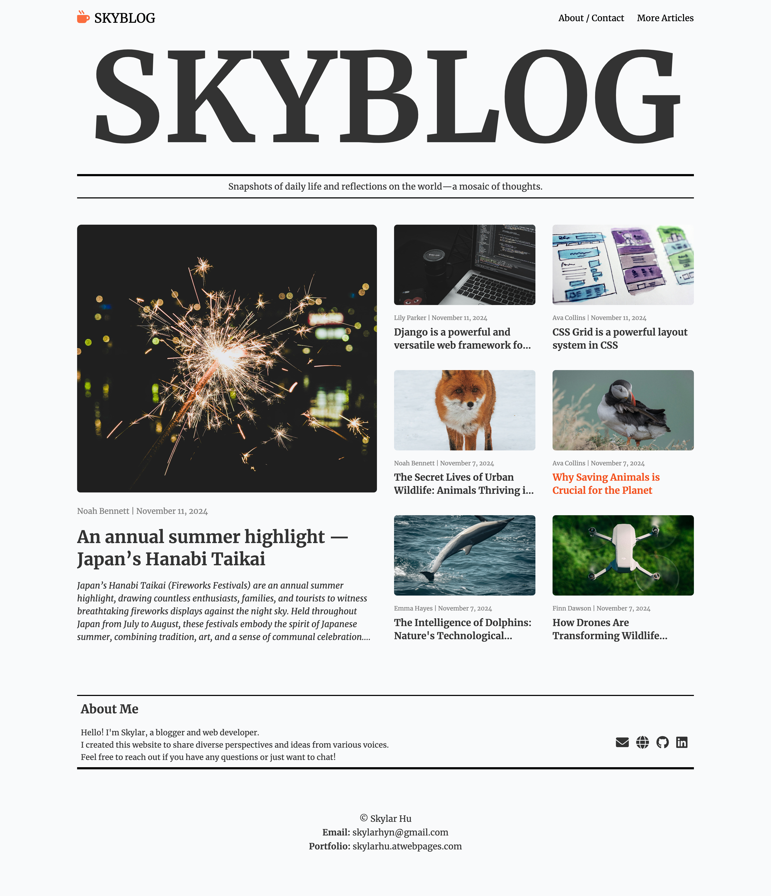
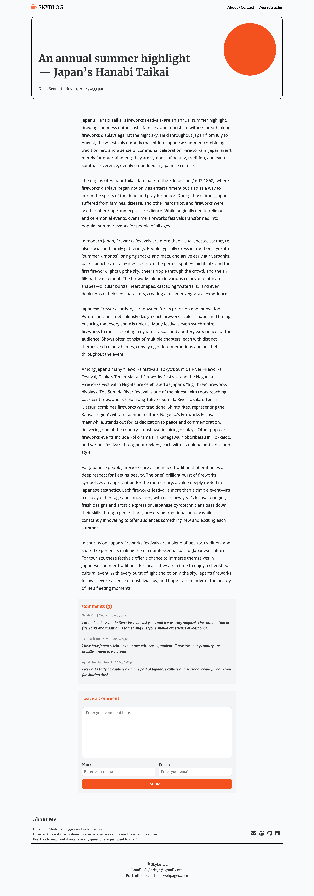
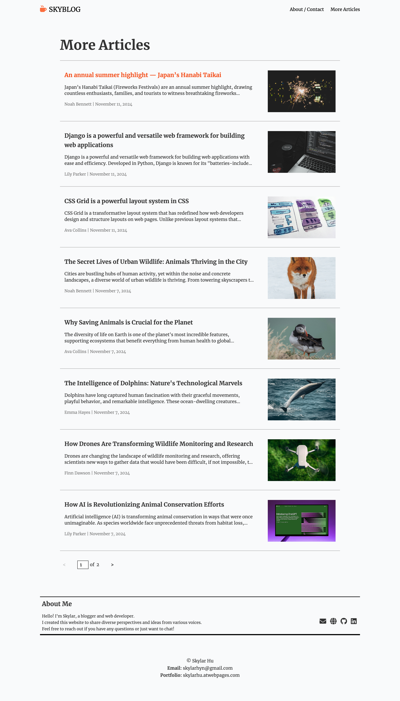

# SkyBlog

SkyBlog is a blogging website built with the [Django](https://www.djangoproject.com/) framework, offering features such as article publishing, commenting, and paginated browsing. The project is deployed on [Railway](https://railway.app/) and utilizes [AWS S3](https://aws.amazon.com/s3/) for media file storage. The frontend is responsive, ensuring a good user experience across devices.

- **Live Site**: [https://sky-blog.up.railway.app/](https://sky-blog.up.railway.app/)

## Screenshots




## Features

- **Blog Article Publishing**: Administrators can publish new articles through the Django admin panel.
- **Comment System**: Users can add comments on article detail pages; admins can manage and moderate comments.
- **Pagination**:
  - The homepage displays 7 articles.
  - The `more_articles` page lists all articles, with a maximum of 8 articles per page, allowing users to navigate pages.
- **Media File Storage**: AWS S3 is used to store blog images and other media files.
- **Responsive Design**: The design utilizes CSS Flexbox and Grid for a layout that adapts to different screen sizes.

## Project Structure

```
.
├── blog                 # Blog application with models, views, URLs, and admin configurations
├── mysite               # Main project directory with configuration and WSGI/ASGI settings
├── media                # Local media directory (for development)
├── static               # Static files directory
├── templates            # HTML templates
├── start.sh             # Project start script
├── requirements.txt     # Python dependencies
├── manage.py            # Django management script
└── Procfile             # For deploying the app on production
```

## Getting Started

### Prerequisites

- Python version: 3.12.3
- Django version: 5.1.3
- Database: SQLite3

### Installation

1. **Clone the repository**:
   ```bash
   git clone https://github.com/SkylarYHU/skyblog.git
   cd skyblog
   ```

2. **Create and activate a virtual environment**


3. **Install dependencies**:
   ```bash
   pip install -r requirements.txt
   ```

4. **Set environment variables**:

   Create a `.env` file in the root directory for development, or configure environment variables directly on Railway for production. Set the following variables:

   ```plaintext
   DEBUG=True
   SECRET_KEY=your_secret_key
   ALLOWED_HOSTS=127.0.0.1, .railway.app
   AWS_ACCESS_KEY_ID=your_aws_access_key
   AWS_SECRET_ACCESS_KEY=your_aws_secret_key
   ```

5. **Run database migrations**:
   ```bash
   python manage.py makemigrations
   python manage.py migrate
   ```

6. **Collect static files**:
   ```bash
   python manage.py collectstatic --noinput
   ```

7. **Run the development server**:
   ```bash
   python manage.py runserver
   ```

### Running the Project in Production

To deploy on Railway or another cloud platform, start the project using `start.sh`:

```bash
bash start.sh
```

Contents of `start.sh`:

```bash
python manage.py makemigrations
python manage.py migrate
python manage.py collectstatic --noinput
gunicorn mysite.wsgi:application --bind 0.0.0.0:8080
```

## Environment Variables

The following environment variables are configured on Railway:

- `ALLOWED_HOSTS`: Allowed hosts (e.g., `.railway.app`)
- `DEBUG`: Set to `False` for production
- `AWS_ACCESS_KEY_ID` and `AWS_SECRET_ACCESS_KEY`: Access keys for AWS S3 bucket
- `SECRET_KEY`: Django project secret key

## Database

This project uses SQLite3 as the database in development. For production, a more robust database like PostgreSQL is recommended.

## Media File Storage

- **Bucket Name**: `skyblog-web`
- **Region**: `eu-north-1`
- **Access**: Media files are stored in an AWS S3 bucket with public read access.

Relevant configuration in `settings.py`:

```python
AWS_STORAGE_BUCKET_NAME = 'skyblog-web'
AWS_S3_REGION_NAME = 'eu-north-1'
DEFAULT_FILE_STORAGE = 'storages.backends.s3boto3.S3Boto3Storage'
MEDIA_URL = f'https://{AWS_STORAGE_BUCKET_NAME}.s3.{AWS_S3_REGION_NAME}.amazonaws.com/'
```

## Frontend Design

### Technologies Used

- **CSS Flexbox and Grid**: Provides a responsive layout across devices.
- **Fonts**: Uses [Google Fonts](https://fonts.google.com/) (Merriweather and Open Sans) for a visually pleasing design.
- **Colors**: A soft color scheme for readability, with light gray and bright orange accents.

### Page Structure and Styles

- **Homepage**: Displays a large title, blog intro, main card with the latest article, and a grid for other recent articles.
- **Article Detail Page**: Shows the full content of an article, with metadata and comments section.
- **More Articles Page**: Lists all articles with pagination.
- **Comment Section**: Styled form fields with clear borders and focus effects.

## Dependencies

All required Python packages are listed in `requirements.txt`. Install them with:

```bash
pip install -r requirements.txt
```

Contents:

```
asgiref==3.8.1
bleach==6.2.0
boto3==1.35.58
dj-database-url==2.3.0
Django==5.1.3
django-storages==1.14.4
django-summernote==0.8.20.0
gunicorn==23.0.0
psycopg2==2.9.10
whitenoise==6.8.2
```

## Deployment Notes

This project is deployed on Railway using the following configuration and commands:

- **Start Command**: `bash start.sh`
- **Environment Variables**: Configured on Railway for `ALLOWED_HOSTS`, `DEBUG`, `AWS_ACCESS_KEY_ID`, `AWS_SECRET_ACCESS_KEY`, and `SECRET_KEY`.
